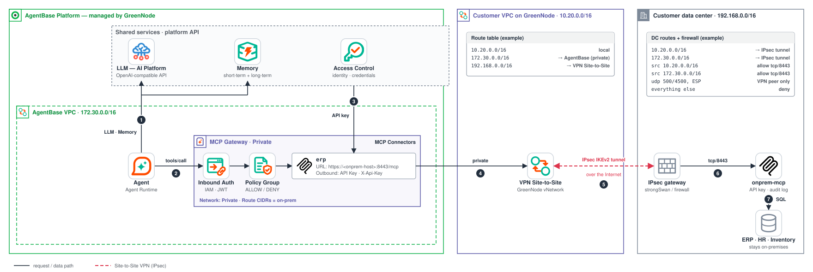

# On-prem MCP server over VPN Site-to-Site: let an AgentBase agent use data that never leaves your data center

> A reference sample showing how an agent on **GreenNode AgentBase** calls an **MCP server that runs in your own
> data center**, connected to your GreenNode VPC with the managed **VPN Site-to-Site (IPsec)** service, through a
> **Private MCP Gateway**. The gateway keeps authentication, policy and audit; the data stays on-premises.

[](https://github.com/GreenNode-Samples/sample-onprem-mcp-vpn/actions/workflows/ci.yml)
[](LICENSE)



## The problem

Enterprise agents become useful when they can answer questions about HR, procurement, inventory or finance. That data
usually lives in systems inside the company data center, and policy says it must not be copied to a cloud or exposed
to the Internet. You still want the agent platform's controls: who may call which tool, with what credentials, and an audit trail.

## The solution

Keep the system where it is and put a small **MCP server** next to it. Connect the data center to your GreenNode VPC with
an IPsec tunnel, and let a **Private MCP Gateway** forward governed tool calls through that tunnel.

```
Agent on AgentBase Runtime
   |  tools/call  (Inbound Auth: IAM Permissions or JWT)
   v
MCP Gateway (Private)                  runs in the AgentBase VPC 172.30.0.0/16, managed by GreenNode
   |  1. Policy Group: is  erp__<tool>  allowed for this agent?  (no policy group attached => every tools/call is 403)
   |  2. Connector `erp`: MCP endpoint URL + Outbound Auth = API Key, header X-Api-Key, secret stored in Access Control
   v
private connection to your VPC         your VPC must be privately connected to AgentBase (request it from GreenNode support);
   |                                    the gateway's Route CIDRs include the on-prem CIDR
   v
Customer VPC  ->  route: on-prem CIDR via the VPN gateway
   |
   |  VPN Site-to-Site (IKEv2 / IPsec, customer side)
   v
Data center: IPsec peer -> firewall (allow source 172.30.0.0/16 and the VPC CIDR to the MCP port only)
   |
   v
MCP server  :8443 (TLS) / :8080   -> validates the API key (fail-closed) -> audit log -> SQLite "ERP" data
```

What this gives you: the agent never sees the API key, the server is not reachable from the Internet, every call is
authorized by a Policy Group at the gateway and logged again at the server, and there is no data copy in the cloud.

## What is in this repository

```
src/onprem_mcp/main.py        MCP server (FastMCP, streamable HTTP /mcp, GET /health), SQLite demo data, API-key auth, audit log
src/onprem_mcp/healthcheck.py Container health probe (the Docker HEALTHCHECK)
tests/                        pytest suite (tools, input validation, auth middleware, audit log, client example, shell scripts)
examples/mcp_client.py        Minimal MCP client: direct (API key) or through the gateway (Bearer token)
Dockerfile, requirements*.txt Container image (non-root) and dependencies
infra/greennode/README.md     Console runbook: VPC, VPN Site-to-Site, routes, ACL, private connection, gateway, connector, policy
infra/onprem/                 Data-center side: strongSwan, nftables, docker-compose (+ Caddy TLS), connectivity check, other gateways
lab/                          Test everything without a real data center (simulated "on-prem" VM)
docs/architecture.svg         Architecture diagram (referenced above)
```

### The demo MCP server

A stand-in for an internal enterprise system, backed by SQLite and seeded with fictional data (nothing real).
All tools are read-only (the database is opened in read-only mode by the tools, and the tools carry the MCP
`readOnlyHint` annotation).

| Tool | Policy action | Description |
|---|---|---|
| `find_employee(query)` | `erp__find_employee` | Search the directory by name or department (any letter case, Vietnamese diacritics included): `employee_id`, `name`, `department`, `title` only |
| `leave_balance(employee_id)` | `erp__leave_balance` | Annual leave balance of one employee for the current calendar year (Asia/Ho_Chi_Minh) |
| `sick_leave_balance(employee_id)` | `erp__sick_leave_balance` | Sick leave balance, a tool of its own: gateway policies allow or deny whole tools, so a Policy Group can grant annual leave without exposing sick leave |
| `list_purchase_orders(status)` | `erp__list_purchase_orders` | Purchase orders (newest first), filtered by `pending_approval`, `approved`, `received`, `cancelled` or `all` |
| `get_purchase_order(po_id)` | `erp__get_purchase_order` | One purchase order with line items and total |
| `inventory_level(sku)` | `erp__inventory_level` | Stock per warehouse with reorder status |

Every tool returns a JSON object (MCP structured output). A failed call, for example an unknown id or an argument that
breaks the declared schema, is an MCP tool error: the result has `isError: true` and a plain-text message. The two list
tools return at most 20 rows and say so: `total` is the number of all matches and `truncated` is `true` when rows were
left out. Money is stored as integer cents, so line totals and order totals are exact and identical in the list and in
the detail. The e-mail address, manager and location of an employee are deliberately not part of the demo data
(minimal personal data in tool results).

Arguments are validated by the tool schema on every call (`pattern`, `minLength`/`maxLength`, `enum`) and every query is
parameterized. The database file is created and seeded when the server starts; to pick up a changed demo schema after
upgrading this sample, delete the old database (`data/erp.db`, or the `mcp_data` volume).

## Prerequisites

- A GreenNode account with the **Root** or **Admin** role, access to vNetwork / vServer and AgentBase.
- A data center (or the [lab VM](lab/README.md)) with a **public IP** for the IPsec device and a host for the MCP server.
- CIDRs that do not overlap: the AgentBase VPC `172.30.0.0/16`, your VPC, and the data-center network (examples:
  `10.20.0.0/16` for the VPC and `192.168.0.0/16` for the data center; replace them with your ranges).
- GreenNode support to activate the **private connection** between your VPC and AgentBase (only privately connected VPCs
  are offered when creating a Private gateway). The VPC needs DNS resolution enabled.
- Docker (server), Python 3.12 (tests and client example), `bash` and `curl` (connectivity check).

## Quick start (local)

Run the server locally, without any network setup:

```bash
export MCP_KEY=$(openssl rand -hex 32)          # 32+ characters; keep it: the gateway connector will need the same value later
docker build -t onprem-mcp-server .
docker run --rm -p 127.0.0.1:8080:8080 -e MCP_API_KEYS="$MCP_KEY" onprem-mcp-server
```

```bash
curl -s http://127.0.0.1:8080/health                                       # open, no key
curl -s -X POST http://127.0.0.1:8080/mcp -H 'Content-Type: application/json' \
  -H 'Accept: application/json, text/event-stream' \
  -d '{"jsonrpc":"2.0","id":1,"method":"tools/list"}' -o /dev/null -w '%{http_code}\n'   # 401: key required
```

Call a tool with an MCP client (header `X-Api-Key`):

```bash
pip install -r requirements.txt
MCP_URL=http://127.0.0.1:8080/mcp MCP_API_KEY="$MCP_KEY" python examples/mcp_client.py \
  --call find_employee --args '{"query":"nguyen"}'
```

Or in your own code:

```python
import asyncio, os
from mcp import ClientSession
from mcp.client.streamable_http import streamablehttp_client

async def main():
    async with streamablehttp_client("http://127.0.0.1:8080/mcp",
                                     headers={"X-Api-Key": os.environ["MCP_KEY"]}) as (r, w, _):
        async with ClientSession(r, w) as session:
            await session.initialize()
            print([t.name for t in (await session.list_tools()).tools])
            print((await session.call_tool("leave_balance", {"employee_id": "E1002"})).content[0].text)

asyncio.run(main())
```

Without Docker: `pip install -r requirements.txt && MCP_API_KEYS="$MCP_KEY" python src/onprem_mcp/main.py`
(`ALLOW_ANONYMOUS=true` lets you start without a key, for local development only).

Environment variables of the server (all optional except the key; the same list is in [`.env.example`](.env.example)):
`MCP_API_KEYS`, `ALLOW_ANONYMOUS`, `HOST` (default `0.0.0.0`), `PORT` (default `8080`), `DB_PATH`, `TRUST_FORWARDED_FOR`
and `TRUSTED_PROXIES`.

## Step-by-step deployment

| Step | Where | What |
|---|---|---|
| 1 | [`infra/greennode/README.md`](infra/greennode/README.md), (a) to (d) | CIDR plan, VPC and subnets, **VPN Site-to-Site**, route table |
| 2 | [`infra/onprem/`](infra/onprem/README.md) | strongSwan (or your firewall) as IPsec peer, return routes, firewall, MCP server, `check_connectivity.sh` from the VPC |
| 3 | [`infra/greennode/README.md`](infra/greennode/README.md), (e) to (f) | Optional ACL, private connection request to GreenNode support |
| 4 | [`infra/greennode/README.md`](infra/greennode/README.md), (g) to (k) | **Private** MCP Gateway, Access Control key, connector `erp`, Policy Group, end-to-end verification |
| Lab | [`lab/README.md`](lab/README.md) | The same flow with a simulated data center |

Network summary: the gateway runs in `172.30.0.0/16`; its **Route CIDRs** include the on-prem CIDR; the customer VPC route
table sends the on-prem CIDR to the VPN gateway; the data center routes back **both** the customer VPC CIDR and
`172.30.0.0/16` through the tunnel; its firewall allows source `172.30.0.0/16` (and the VPC CIDR) to the MCP port.

The IPsec parameters (IKEv2, AES-256-GCM, SHA-256, DH group 3072 with 2048 as fallback, pre-shared key) are taken from the
GreenNode "Support IPSEC Configuration" page and the pfSense demo; see the table in the
[runbook](infra/greennode/README.md#ike-and-ipsec-parameters-selected).

## Security checklist

- [ ] **Least-privilege policy**: one Policy Group rule per agent, explicit `erp__<tool>` actions, no `["*"]`. Without any Policy Group, all `tools/call` return 403 by design.
- [ ] **API key**: generated with `openssl rand -hex 32`, stored in Access Control and in the server `.env` (`chmod 600`), never in git or in agent code. The server is **fail-closed**: no `MCP_API_KEYS` means `503` on `/mcp`, and so does any key that is shorter than 32 characters, contains `<` or `>`, or is a placeholder from an example file (the reason, never the key, is logged at startup).
- [ ] **Key rotation without downtime**: list two keys (`MCP_API_KEYS=old,new`), switch the Access Control provider to `new`, then remove `old`.
- [ ] **Firewall source restriction**: IKE, NAT-T and ESP only from the GreenNode VPN IP; the MCP port only from `172.30.0.0/16` and the VPC CIDR (verify which source the data center really sees); everything else dropped ([`infra/onprem/firewall/nftables.conf`](infra/onprem/firewall/nftables.conf)).
- [ ] **No exposure**: the server binds to an internal address only (`MCP_BIND_ADDR`), never `0.0.0.0` on a host with a public interface; no public port forwarding.
- [ ] **TLS**: use the Caddy profile (`https://<host>:8443/mcp`) with a certificate from a CA the gateway trusts; keep plain `:8080` for tests only.
- [ ] **Strong IPsec**: AEAD or SHA-256 or better, DH group 14 or larger, a long random pre-shared key; avoid the algorithms flagged as weak (`md5`, `sha`, `modp1024` and below).
- [ ] **Audit logs**: after every tool call the server logs `audit tool=<name> caller=<ip> key=<8 hex digits of sha256(key)> status=<HTTP status> ms=<duration>` (no arguments, no secrets; a tool name that is not a plain identifier is logged as `<invalid>`, and log lines cannot be forged with newlines). Ship `docker compose logs mcp` to your SIEM and compare with the gateway audit log. Set `TRUST_FORWARDED_FOR=true` only behind Caddy: the `X-Forwarded-For` header is then believed only for requests that come from `TRUSTED_PROXIES` (default: loopback), never from other clients.
- [ ] **Container hardening**: non-root user, read-only root filesystem, all capabilities dropped (see `infra/onprem/docker-compose.yml`). `/health` is a liveness probe only and reveals nothing about keys or configuration.
- [ ] **Network ACL / security groups** tightened after the end-to-end test passes (runbook step e).

## Troubleshooting

| Symptom | Likely cause | What to check |
|---|---|---|
| VPN stays `Provisioning` or is `Active` but the data center never shows `ESTABLISHED` | Tunnel down: UDP 500/4500 or ESP blocked, wrong peer IP, pre-shared key or algorithm mismatch | `swanctl --list-sas`, `journalctl -u strongswan`; `NO_PROPOSAL_CHOSEN` = proposals differ from the VPN detail page, `AUTHENTICATION_FAILED` = PSK or ids; GreenNode VPN **log** tab |
| Console error 2017 / 2023 when creating the VPN | Overlapping CIDRs between VPC and data center, or between remote sites | Re-plan the CIDRs (never use `172.30.0.0/16`) |
| Console error 2018 / 2019 / 2020 / 2021 | Remote CIDR is not private, or the remote gateway IP is not a public IP | Use an RFC 1918 CIDR and a public peer IP |
| Tunnel `ESTABLISHED` but ping and `check_connectivity.sh` fail (step 1) | **Routes missing**: no route for the on-prem CIDR to the VPN gateway in the VPC route table, or no return route on the MCP host | Runbook step d; on the data center add routes for the VPC CIDR **and** `172.30.0.0/16` toward the IPsec peer |
| `check_connectivity.sh` passes but the gateway times out | Gateway path differs: Route CIDRs do not include the on-prem CIDR, no return route for `172.30.0.0/16`, firewall blocks that source, or the source is NATed to a VPC address | Gateway **Network & Compute** tab; `docker compose logs mcp \| grep audit` (shows whether calls arrive and from where; in the lab: `docker logs onprem-mcp`); firewall counters |
| Private gateway cannot select the VPC | The VPC is not privately connected to AgentBase yet, or the list is stale | Contact GreenNode support (runbook f); use the refresh icon |
| Hostname does not resolve | DNS resolution (vDNS) disabled on the VPC, or no DNS path to the data-center resolver | Use the IP in the connector URL, or enable DNS and forward the zone: verify with GreenNode |
| TLS handshake error at the connector | The certificate is not issued by a CA the gateway trusts, or does not match the host in the URL | Use an enterprise or public CA, match `CADDY_SITE` to the connector host; ask GreenNode about custom CAs |
| `401` on `/mcp` | Key missing or wrong: the Access Control value differs from `MCP_API_KEYS`, header key is not `X-Api-Key`, or the prefix was left as `Bearer ` | Connector Outbound Auth settings; `docker compose logs mcp` (`401 on /mcp from <ip>`) |
| `503` on `/mcp` | Server has no usable `MCP_API_KEYS` (fail-closed): not set, shorter than 32 characters, or still the placeholder of `.env.example` | `docker compose logs mcp` names the rejected entry; put the output of `openssl rand -hex 32` in `.env` and restart |
| `401` from the gateway endpoint (before the server) | Inbound Auth failed: expired IAM token, wrong JWT issuer or audience | Get a fresh token; check Inbound Auth settings |
| `403` on `tools/call` (`tools/list` works) | No Policy Group attached, or the principal or `erp__<tool>` action is not allowed | Gateway **Policy** tab; policy changes apply within about 30 seconds |
| `404` or `Session terminated` | Wrong path: the gateway URL must end with the connector name (`.../erp`) and the connector URL must end with `/mcp` | Re-copy the Endpoint URL from the gateway detail page |
| `5xx` from the gateway | The server is unreachable or returned an error | Connectivity from the VPC, server logs, connector endpoint URL and scheme (HTTP vs HTTPS) |
| Intermittent resets on large responses | MTU / fragmentation through the tunnel | Keep the MSS clamp in `nftables.conf` (1360) |
| Locked out of SSH right after applying `nftables.conf` | `ADMIN_NET` still has the example value | Fix it from the console (`sudo nft delete table inet onprem_mcp`), set `ADMIN_NET` to your address, apply again |

## Verify with GreenNode

These items are not stated in the public documentation used for this sample. Confirm them with GreenNode support
before production use:

1. **Gateway source address**: does traffic from the MCP Gateway reach the data center as `172.30.0.0/16`, or source-NATed to a VPC address? (The firewall and ACL rules open both until this is known; the MCP server audit log shows the real source.)
2. **Tunnel selectors**: can the VPN tunnel carry `172.30.0.0/16`, or only the VPC CIDR?
3. **Route in the VPC**: is a route for `172.30.0.0/16` needed in the customer VPC route table, which route table applies to traffic that enters the VPC from AgentBase, and is the route to the VPC CIDR added on the AgentBase side automatically after the private connection is activated?
4. **Default IKE / IPsec policy**: the exact values applied by the console (DH group 2048 per the keyword table versus 3072 in the pfSense demo), Phase 2 PFS, and whether the policy can be customized yet.
5. **Lifetimes**: the demo page prints a Phase 1 lifetime of `144000` for "4 hours" (14400 s expected).
6. **DPD and NAT-T** behavior, including data-center devices that sit behind NAT.
7. **Connector endpoint**: whether `http://` is accepted (the docs describe a full HTTPS URL), and how an internal or custom CA is provided for TLS.
8. **Gateway endpoint reachability**: whether the Private gateway endpoint is reachable only from privately connected networks, and which network mode the calling agent runtime needs.
9. **Network mode** of a gateway is fixed after creation (assumed, not documented in the pages used here).
10. **VPC DNS**: where DNS resolution (vDNS) is enabled, and name resolution of data-center hostnames.
11. **Network ACL**: how the VPN data path interacts with subnet ACLs, how "Port range" is matched, and the apparent difference between the default allow-any rule and "a new ACL denies all".
12. **Policy principal**: the exact `iam:<id>` value for an agent runtime on your gateway version.
13. **VPN details**: the field that shows the GreenNode VPN public IP, and the phase 1 / phase 2 status indicators (the FAQ says they are coming).

## Tests

```bash
pip install -r requirements-dev.txt
python -m pytest tests/ -q          # hermetic: temporary SQLite database, no network
bash -n infra/onprem/check_connectivity.sh lab/lab_setup_onprem.sh
```

The suite covers each tool against a temporary database, input validation (including SQL-injection and LIKE-wildcard
inputs), the fail-closed API-key middleware (503 / 401 / 200, both header styles, key rotation, `/health` open) and the
audit log (tool name and caller recorded, no secrets).

## Related samples

- [`sample-mcp-stock-server`](../sample-mcp-stock-server): the same fail-closed MCP server pattern, deployed on Agent Runtime, vServer / VKS or on-prem.
- [`sample-byo-agent-mcp-gateway`](../sample-byo-agent-mcp-gateway): call an MCP Gateway from your own agent, with IAM or JWT inbound auth.

## License

[MIT](LICENSE)
